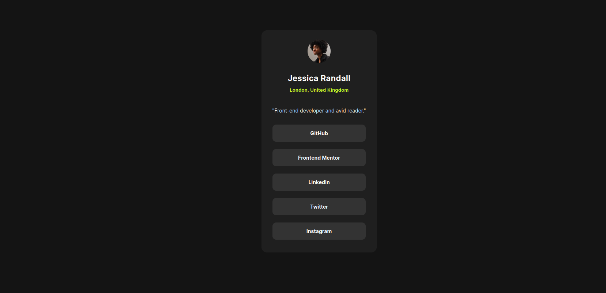
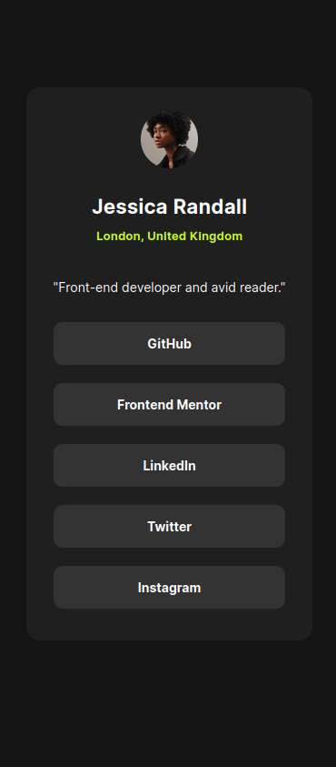

# Frontend Mentor - Social links profile solution

This is a solution to the [Social links profile challenge on Frontend Mentor](https://www.frontendmentor.io/challenges/social-links-profile-UG32l9m6dQ). Frontend Mentor challenges help you improve your coding skills by building realistic projects. 

## Table of contents

- [Overview](#overview)
  - [The challenge](#the-challenge)
  - [Screenshot](#screenshot)
  - [Links](#links)https://sociallinksprofile.pages.dev/
- [My process](#my-process)
  - [Built with](#built-with)
  - [What I learned](#what-i-learned)
  - [Continued development](#continued-development)
- [Author](#author)

**Note: Delete this note and update the table of contents based on what sections you keep.**

## Overview

### The challenge

Users should be able to:

- See hover and focus states for all interactive elements on the page

### Screenshot

Add a screenshot of your solution. The easiest way to do this is to use Firefox to view your project, right-click the page and select "Take a Screenshot". You can choose either a full-height screenshot or a cropped one based on how long the page is. If it's very long, it might be best to crop it.

Alternatively, you can use a tool like [FireShot](https://getfireshot.com/) to take the screenshot. FireShot has a free option, so you don't need to purchase it. 

Then crop/optimize/edit your image however you like, add it to your project, and update the file path in the image above.

**Note: Delete this note and the paragraphs above when you add your screenshot. If you prefer not to add a screenshot, feel free to remove this entire section.**

### Links

- Solution URL: [Github repo is here](https://github.com/mbalali63/SocialLinksProfile.git)
- Live Site URL: [You can see the result here](https://sociallinksprofile.pages.dev/)

## My process

### Built with

I have used the followings to build this project:

- HTML5 markup
- CSS custom properties
- Flexbox
- [React](https://reactjs.org/) - JS library

### What I learned

In this project I practice the special power of react in designing front-end UI. The combination of HTML/CSS with js power makes it great. I wsa able to create an array of buttons, with just few lines. And the captions of the buttons were all given as an array of texts.

I had also a challenge while deploying the page on cloudfare to show it to the audiences. Finally I find an approach that instead of installing on the website using online cloudfare commands, I just built the project on my PC, and then upload the build folder to cloudfare. and now the page is shown properly. I will appreciate for any guidance about how install cloudfare bunch of errors and deprication warnings during build process.

There was another challenge on showing images in React app. Initially the image I added to project with img and addressed it in src tag of img element, was not shown on the page. I checked the web and find out that as it is compiled by webpack, the image source must be imported to the component using a require statement.

The previous challenges, I was always commented for Semantic HTML. in this project I tried to improve the semantic structure of my html, but I am sure it requires more work on.

### Continued development

I have to improve my skills in semantic html struturing. Altough The responsiveness of my pages became better, but I still need to improve it.
I will also work on improving my skills in working with React.

## Author

- Frontend Mentor - [@mbalali63](https://www.frontendmentor.io/profile/mbalali63)
- Twitter - [@codinggeek1984](https://www.twitter.com/codinggeek1984)

